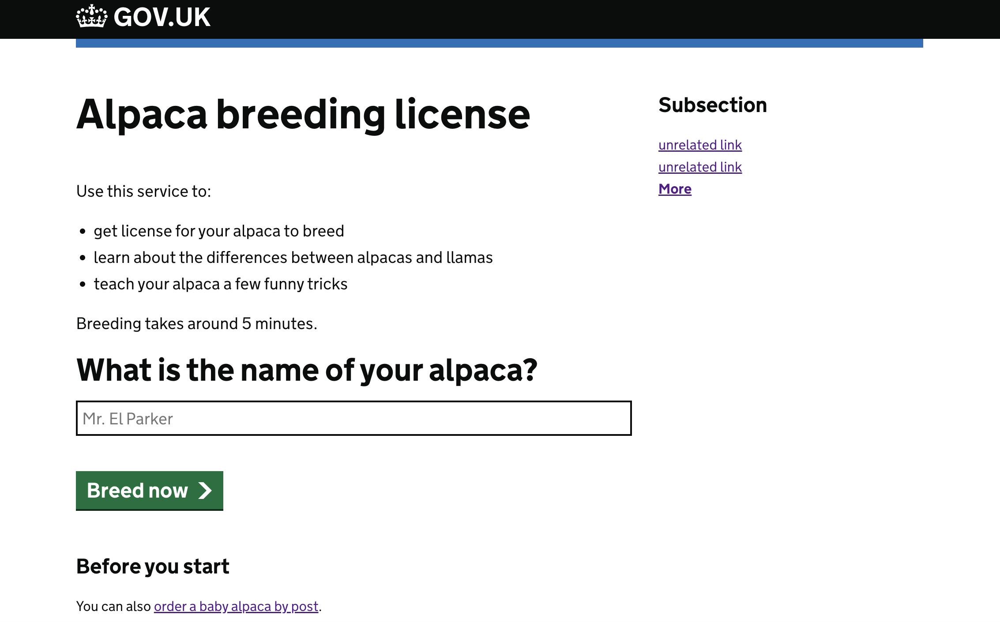

# Demo sinatra app with GOV.UK style

A skeleton folder of a sinatra app with some [GOV.UK styling](https://frontend.design-system.service.gov.uk/). Started as a practice of how to incorporate the GOV.UK styles into a webapp.


## How to run
```shell
npm install
bundle install

bundle exec rackup
```
then visit localhost:9292

## where is the sass/css file?

I found two ways to introduce the sass file into the page.
1. set a get endpoint to your css file explicitly by something like this
```ruby
get '/main.css' do
  sass :main
end
```
then, in your html page / erb template, add a link to main.css

2. put the sass in public/stylesheets/sass/main.sass
then, in your html page, add a link to stylesheets/main.css.

seems that the rack plugin setup in my config.ru loads the .sass and compile it to .css file with the same name. I am not sure. It seems working.

## other assets? (fonts/images/js)
All are in `public` directory. Didn't figure out how to serve them from app folder yet.

## how it should look like (if running successfully)

